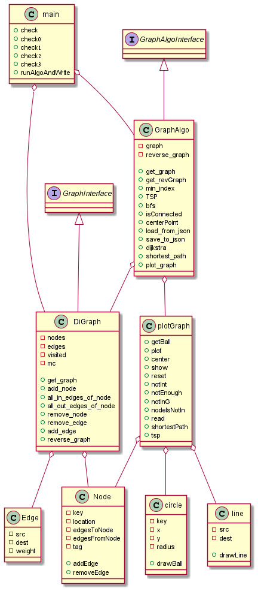

# Third Assignment - OOP Course
## Credits:
This Project made by: Talia Seada (ID: 211551601) and Lior Breitman (ID: 212733257).  
__NOTE:__ In this projects the group members used "Code With Me" in the Pycharm workspace, so most of the commits are
from one main computer, while all the members were working on the project together.
## Intro:
This is the 4th assignment on our OOP course as part of our B.sc in computer science
In this assignment, we were asked to implement 3 graph theory algorithms: TSP, shortest path, and Center Point
We implemented a DiGraph class where the directed graph is represented using a dictionary of nodes and a list of edges
To implement all the algorithms we added 2 more algorithms, Dijkstra and BFS: Dijkstra for the shortest path between nodes, and BFS to check if the graph is strongly connected so we can search for a center.
The last part was the GUI which we implemented using PyGame. In the Gui, you can see the graph as well as run algorithms on It to see the results  
For more information - https://github.com/benmoshe/OOP_2021/tree/main/Assignments/Ex3  

The main task of this project is to run and display algorithms on Directed Weighted Graphs.

### GUI:
When running the plot_graph() in the GraphAlgo class we get here.  
How to use the buttons:
1. Reset changes button : This button reset the graph to the default. 
2. Center button : This button prints the center node on the graph.
3. ShortestPath button : This button ask from the user to insert two nodes (integers) and print the shortest path on the graph.
4. TSP button : This button ask from the user to insert two or more nodes (integers) and print the TSP path on the graph.

### Diagram:

### Download and Run
To get this project you need to clone it into a Pycharm project.

Next, to run it, you need to go to main.py file where you will see this:

if you want to run check and check3, you will need to uncomment it and comment the lines from: ga = GraphAlgo() to ga.plot_graph()
Or you can choose a graph from the data folder to load using the file line, or an entirely new graph using the whole path to the json file representing it.

## DO NOT REMOVE THE PYGAME.INIT() OR PYGAME.QUIT() LINES

### Results 

The algorithms were ran on the a computer with the following specs:

Processor	Intel(R) Core(TM) i7-10510U CPU @ 1.80GHz   2.30 GHz

Installed RAM	8.00 GB (7.79 GB usable)

System type	64-bit operating system, x64-based processor
